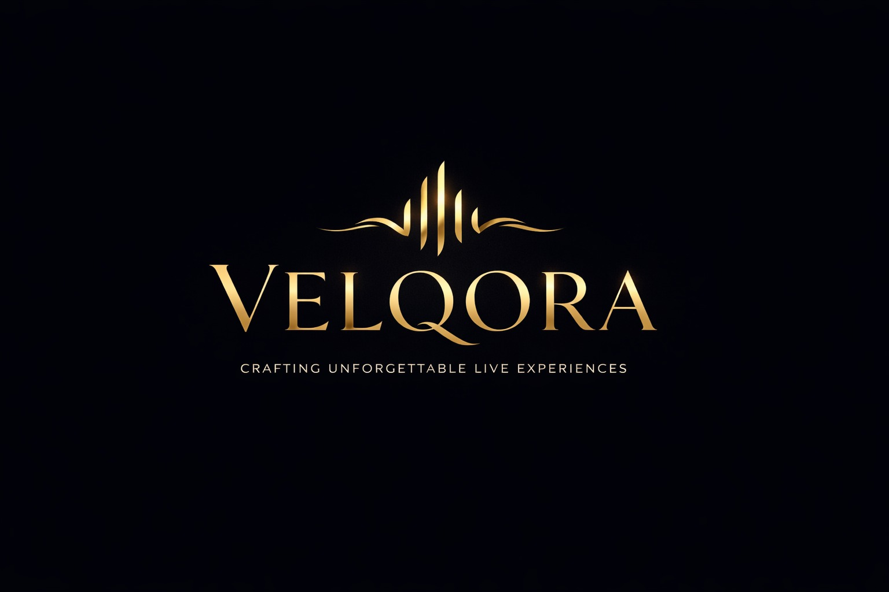

# 🏆 Velqora: Premium Luxury Talent Marketplace



**Velqora** is an ultra-premium, boutique marketplace designed to connect elite musical talent with the world's most exclusive events. Built with a cinematic, high-fashion aesthetic, the platform bridges the gap between high-demand performers and luxury event planners through a secure, curated digital ecosystem.

---

## ✨ Features & Architecture

### 🛡️ Resilient Authentication (Demo Ready)
The platform features a custom **NextAuth** implementation that is specifically hardened for both production and rapid demonstration:
- **Resilient Fallback**: Automatically detects if the local PostgreSQL database is unreachable and triggers a **Mock Auth Mode**. This ensures the platform "just works" for testers without any setup.
- **Role-Based Access Control (RBAC)**: Distinct, secure dashboard environments for **CLIENTS**, **ARTISTS**, and **ADMINS**.
- **Instant Role-Switching**: Testers can switch between all three platform views using a simple role selector on the [Sign-In Page](https://velqoraio.vercel.app/auth/signin).

### 🎨 Boutique Luxury UI/UX
- **Cinematic Experience**: Immersive hero section featuring full-screen HD video backgrounds with ambient lighting systems.
- **Glassmorphic Components**: High-fidelity UI using Gaussian blur, translucent layers, and gold border accents for a "prestige" feel.
- **Circular Brand Identity**: Unified brand framing using circular high-gloss containers for logos and performance previews.
- **Mobile First & Responsive**: Every component—from the artist cards to the analytical dashboards—is optimized for premium mobile experiences.

### 📊 Performance Dashboards
- **Client Control Center**: Streamlined event request creation, offer management, and concierge-level booking flows.
- **Artist Studio**: Portfolios management, gig discovery, and revenue analytics for elite performers.
- **System Intelligence (Admin)**: Holistic platform oversight including revenue velocity charts and artist verification queues.

---

## 🛠️ Technology Stack

| Layer | Technology |
| :--- | :--- |
| **Framework** | Next.js 14+ (App Router) |
| **Styling** | Tailwind CSS (Custom Theme) |
| **Animations** | Framer Motion (Optimized) |
| **Auth** | NextAuth.js (JWT Strategy) |
| **Database** | PostgreSQL (Supabase / Local) |
| **ORM** | Prisma |
| **Icons** | Lucide React |
| **Components** | Radix UI / Shadcn UI |

---

## 🚀 Getting Started

### 1. Installation
```bash
git clone https://github.com/DevNs-cmd/Velqora.io.git
cd Velqora
npm install
```

### 2. Database Sync (Optional)
This project is demo-ready and will work even if your database is offline. To sync a real PostgreSQL database:
```bash
npx prisma generate
npx prisma db push
```

### 3. Development Server
```bash
npm run dev
```
Open [http://localhost:3000](http://localhost:3000) to experience the cinematic landing page.

---

## 📦 Deployment

This project is optimized for deployment on **Vercel** with zero-configuration required. All TypeScript type conflicts and static bails have been pre-resolved for production stability.

---

## 💎 The Velqora Standard
*Curating extraordinary moments for the world's most exclusive events.* 

© 2026 Velqora Private. All Rights Reserved.
